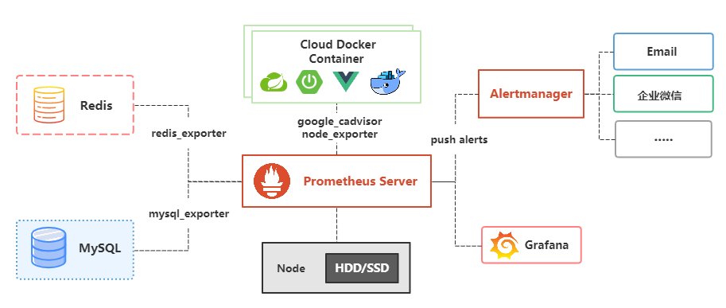
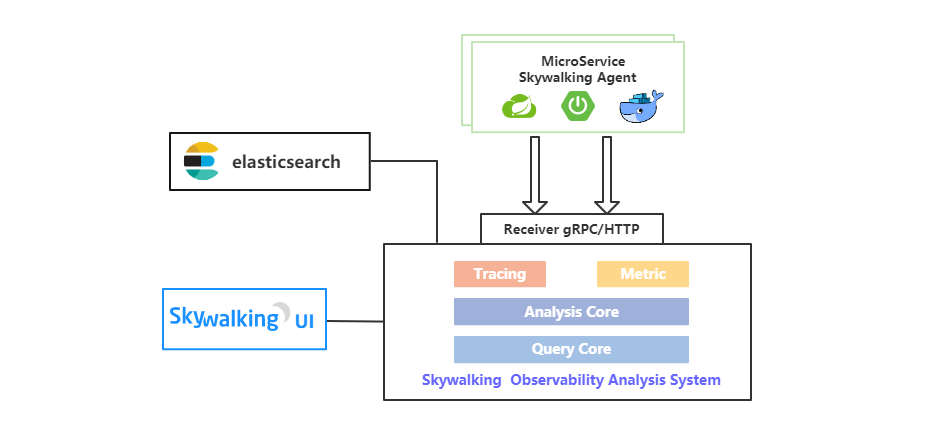
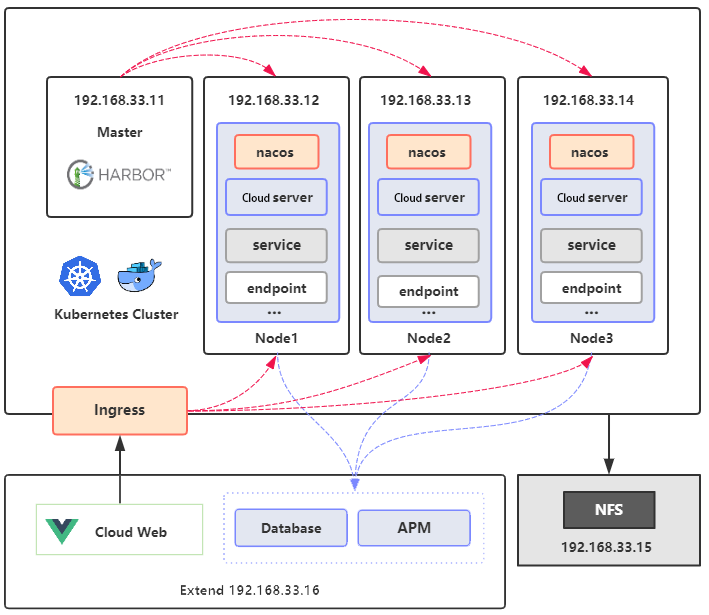
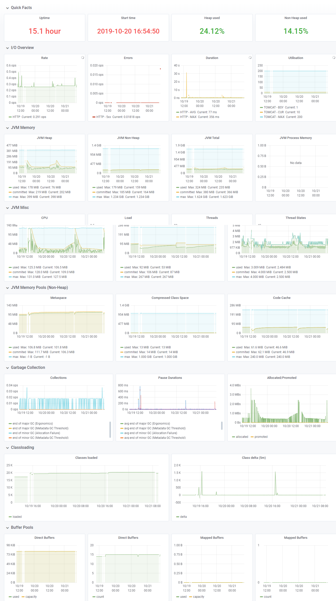
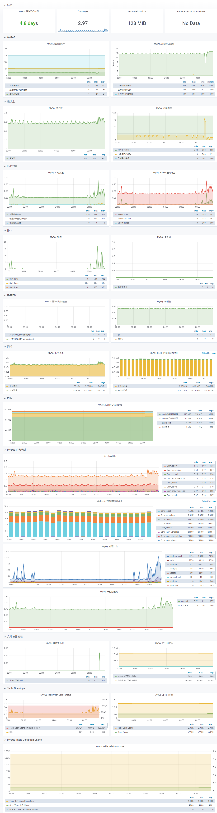
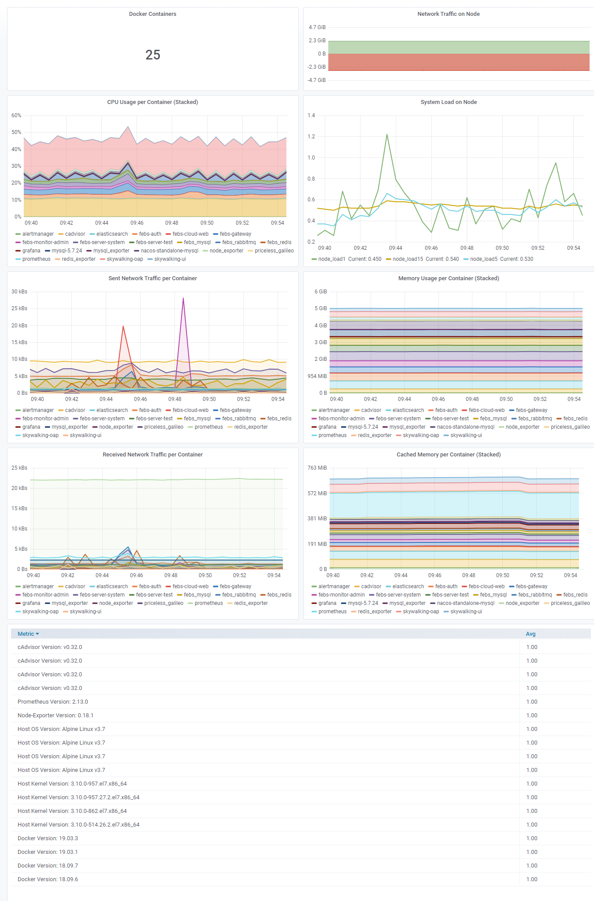
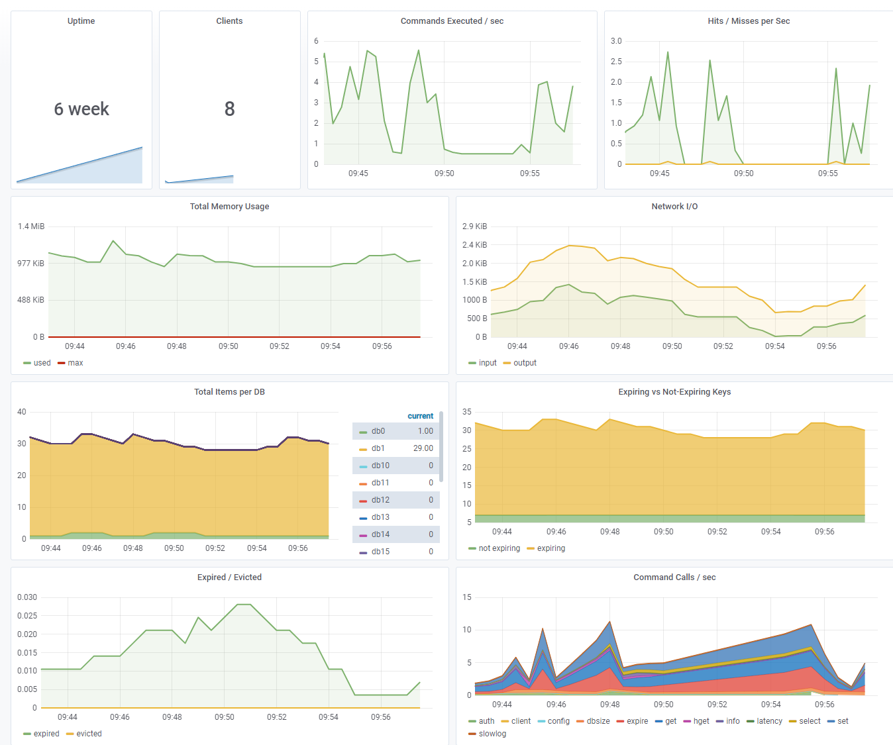

### Turalyon 微服务权限系统


Turalyon 是一款使用Spring Cloud Hoxton.RELEASE、Spring Cloud OAuth2 & Spring Cloud Alibaba构建的低耦合权限管理系统，前端（Cloud Web）采用vue element admin构建。该系统具有如下特点：

序号 | 特点
---|---
1 | 前后端分离架构，客户端和服务端纯Token交互； 
2 | 认证服务器与资源服务器分离，方便接入自己的微服务系统
3 | 集成Prometheus，SpringBootAdmin，Skywalking APM
4 | 网关限流，网关黑名单限制，网关日志（WebFlux编程实践）
5 | 微服务Docker化，使用Docker Compose一键部署，K8S集群
6 | 社交登录，认证授权，数据权限，前后端参数校验，Starter开箱即用等
7 | Doc Starter，几行配置自动生成系统api接口文档
8 | OAuth2 4种模式+刷新令牌模式，提供5种获取系统令牌方式

### 系统架构

<table>
  <tr>
    <td align="center" style="background: #fff"><b>Cloud Demo</b></td>
  </tr>
  <tr>
    <td align="center" style="background: #fff"></td>
  </tr>
  <tr>
  	<td align="center" style="background: #fff"><b>Cloud Prometheus APM</b></td>
  </tr>
  <tr>
  	<td align="center" style="background: #fff"></td>
  </tr>
   <tr>
    <td align="center" style="background: #fff"><b>Cloud Skywalking APM</b></td>
  </tr>
  <tr>
    <td align="center" style="background: #fff"></td>
  </tr>
   <tr>
    <td align="center" style="background: #fff"><b>Cloud Kubernetes</b></td>
  </tr>
  <tr>
    <td align="center" style="background: #fff"></td>
  </tr>
</table>


### 项目地址

 平台  | Cloud Demo（后端） |Cloud Web（前端）
---|---|---
GitHub | https://github.com/Long2273864459/Turalyon.git |

### 

本地部署账号密码：

账号 | 密码| 权限
---|---|---
Liy | 1234qwer |超级管理员，拥有所有增删改查权限

网关管理用户账号密码：

账号 | 密码| 权限
---|---|---
Liy | 123456 |网关管理模块查看权限
admin | 123456 |网关管理模块所有权限

APM平台相关账号密码：

平台 | 账号| 密码
---|---|---
cloud-admin | cloud |123456
cloud-tx-manager | 无 | 123456
Grafana | cloud | 123456

### 服务模块

Cloud模块：

服务名称 | 端口 | 描述
---|---|---
Turalyon-Auth| 8101| 微服务认证服务器 
Turalyon-Server-System| 8201 | 微服务子系统，系统核心模块
Turalyon-Server-Test|8202 | 微服务子系统，Demo模块
Turalyon-Server-Generator|8203 | 微服务子系统，代码生成模块
Turalyon-Server-Job|8204 | 微服务子系统，任务调度模块
Turalyon-Cloud-Gateway|8301|微服务网关
Turalyon-Cloud-Admin|8401|微服务监控子系统
Turalyon-Cloud-Tx-Manager|8501|微服务分布式事务控制器

第三方模块：

服务名称 | 端口 | 描述
---|---|---
Nacos| 8001 |注册中心，配置中心 
MySQL| 3306 |MySQL 数据库 
Redis| 6379 | K-V 缓存数据库 
Elasticsearch|9200 | 日志存储
Logstash|4560|日志收集
Kibana|5601|日志展示
Prometheus|8403~8409|Prometheus APM
Skywalking|11800、12800、8080|Skywalking APM

### 目录结构
```
├─turalyon-apm                        ------ 微服务APM模块
│  ├─turalyon-admin                   ------ 微服务监控中心
│  ├─prometheus-grafana           ------ prometheus grafana apm相关配置，docker文件
│  └─skywalking-elk               ------ skywalking elk相关配置，docker文件
├─turalyon-auth                       ------ 微服务认证服务器
├─turalyon-cloud                      ------ 整个项目的父模块
│  ├─sql                          ------ SQL脚本
│  ├─postman                      ------ postman脚本
│  └─docker compose               ------ 项目相关docker compose文件
├─turalyon-common                     ------ 通用模块
│  ├─turalyon-common-core                   ------ 系统核心依赖包
│  ├─turalyon-common-datasource-starter     ------ 系统数据库自动装配starter
│  ├─turalyon-common-doc                    ------ 文档模块的核心依赖包
│  ├─turalyon-common-doc-gateway-starter    ------ 网关聚合微服务子系统api文档自动装配starter
│  ├─turalyon-common-doc-starter            ------ 微服务子系统api文档自动装配starter
│  ├─turalyon-common-redis-starter          ------ 系统Redis自动装配starter
│  └─turalyon-common-security-starter       ------ 微服务子系统安全配置自动装配starter
├─turalyon-gateway                    ------ 微服务网关
├─turalyon-server                     ------ 微服务子系统
│  ├─turalyon-server-system            ------ 微服务子系统系统核心模块
│  ├─turalyon-server-test             ------ 微服务子系统demo模块
│  ├─turalyon-server-generator        ------ 微服务子系统代码生成模块
│  └─turalyon-server-job              ------ 微服务子系统任务调度模块
└─turalyon-tx-manager                 ------ 微服务分布式事务控制器
```


### 服务APM

#### [Prometheus APM](http://cloud.mrbird.cn:8404)

<table>
  <tr>
     <td width="100%" align="center"><b>JVM监控</b></td>
  </tr>
  <tr>
     <td></td>
  </tr>
  <tr>
  	<td width="100%" align="center"><b>MySQL监控</b></td>
  </tr>
  <tr>
  	<td></td>
  </tr>
   <tr>
     <td width="100%" align="center"><b>Docker容器监控</b></td>
  </tr>
  <tr>
     <td></td>
  </tr>
  <tr>
  	<td width="100%" align="center"><b>Redis监控</b></td>
  </tr>
  <tr>
  	<td></td>
  </tr>
</table>
